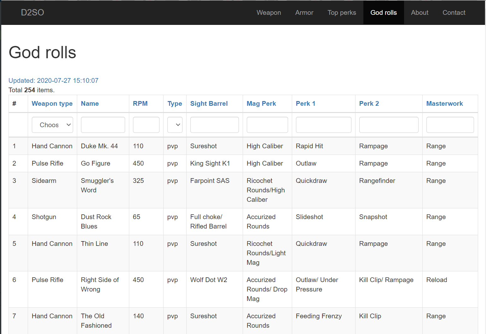

<h1 align="center">Destiny 2 Storage Optimization</h1>

Web application helping to decide what items to keep in storage for Destiny 2.  
Based on [Yii 2](http://www.yiiframework.com/) framework.

---
Implemented OAuth via the Bungie site.  
Originally there was an idea to integrate Bungie API, but then that idea was abandoned in favor of integration with [DIM](https://destinyitemmanager.com/).

Weapon godroll highlighter
------------

Was implemented before the realization of wishlists in DIM - now not very useful.

### Import god rolls
Import god rolls from file `docs/God Roll Weapons.xlsx`.  

On import, the application gets weapon type and rpm from https://destinytracker.com/ by API.
### Import weapons from DIM
Import user weapon from DIM CSV export `docs/destinyWeapons.csv`.

Green cell - godroll, red row - a weapon not in god rolls list

When importing, the application:
- gets PVP and PVE usage from https://destinytracker.com/ by API.
- counts PVP and PVE weapon god rolls based on imported god rolls list, highlights them.
- if the weapon doesn't exist in god rolls list then weapon god rolls is calculated based on weapon type and rpm.
### Export tags for DIM
Export tags with god rolls count for the weapon in DIM CSV format  

Armor stats maximizer
------------

### Import armors from DIM
Import user armor from DIM CSV export `docs/destinyArmor.csv`.

When importing, the application calculates the sums of all possible pairs of attributes:
- Mobility
- Recovery
- Resilience
- Intellect
- Discipline
- Strength

### Export tags for DIM
On export user choose which class armor he wants to export, and a pair of attributes.  
Application export tag `keep` for:
- 3 armor of each type with max chosen a pair of attributes
- if chosen "Export other top sum" - 2 armor from a current season of each type with max other pairs of attribute
- all armors of the current and previous season with the sum of all attributes > 57
- all armors with the sum of all attributes > 60