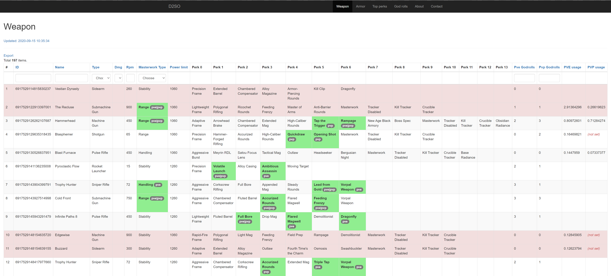

<h1 align="center">Destiny 2 Storage Optimization</h1>

Web application helping to decide what items to keep in storage for Destiny 2.  
Based on [Yii 2](http://www.yiiframework.com/) framework.

---
Implemented OAuth throw Bungie site.  
Originally there was an idea to integrate Bungie api, but than that idea was abandoned in favor integration with [DIM](https://destinyitemmanager.com/).

Weapon godroll highlighter
------------

Was implemented before realization of wishlists in DIM - now not very useful.

### Import godrolls
Import godrolls from file `docs/God Roll Weapons.xlsx`.  

On import application gets weapon type and rpm from https://destinytracker.com/ by api.
### Import weapons from DIM
Import user weapon from DIM csv export `docs/destinyWeapons.csv`.

Green cell - godroll, red row - weapon not in godrolls list
When importing, the application:
- gets pvp and pvp usage from https://destinytracker.com/ by api.
- counts pvp and pve weapon godrolls based on imported godrolls list, highlights them.
- if weapon doesn't exist in godrolls list then weapon godrolls is calculated based on weapon type and rpm.
### Export tags for DIM
Export tags with godrolls count for weapon in DIM csv format

Armor stats maximizer
------------

### Import armors from DIM
Import user armor from DIM csv export `docs/destinyArmor.csv`.

When importing, the application calculates the sums of all possible pairs of attributes:
 - Mobility
 - Recovery
 - Resilience
 - Intellect
 - Discipline
 - Strength

### Export tags for DIM
On export user choose which class armor he wants to export, and a pair of attributes.  
Application export tag `keep` for:
- 3 armor of each type with max chosen a pair of attributes
- if chosen "Export other top sum" - 2 armor from a current season of each type with max other pairs of attribute
- all armors of current and previous season with sum of all attributes > 57
- all armors with sum of all attributes > 60